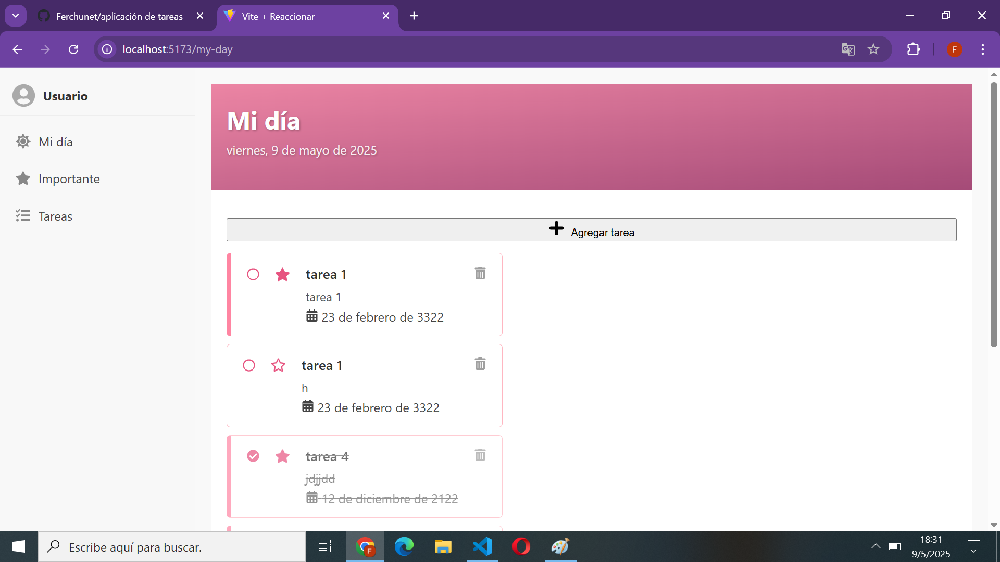
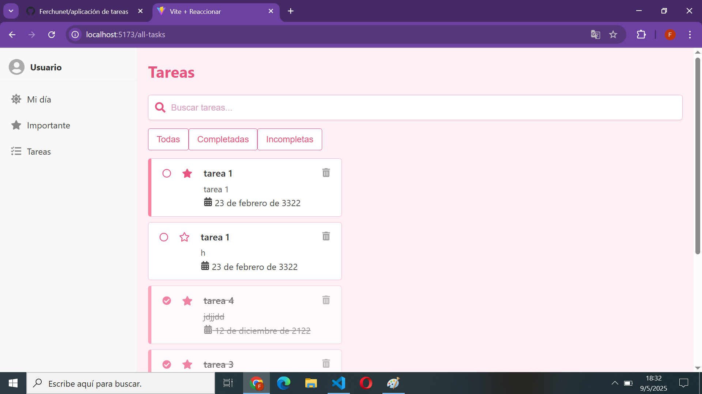
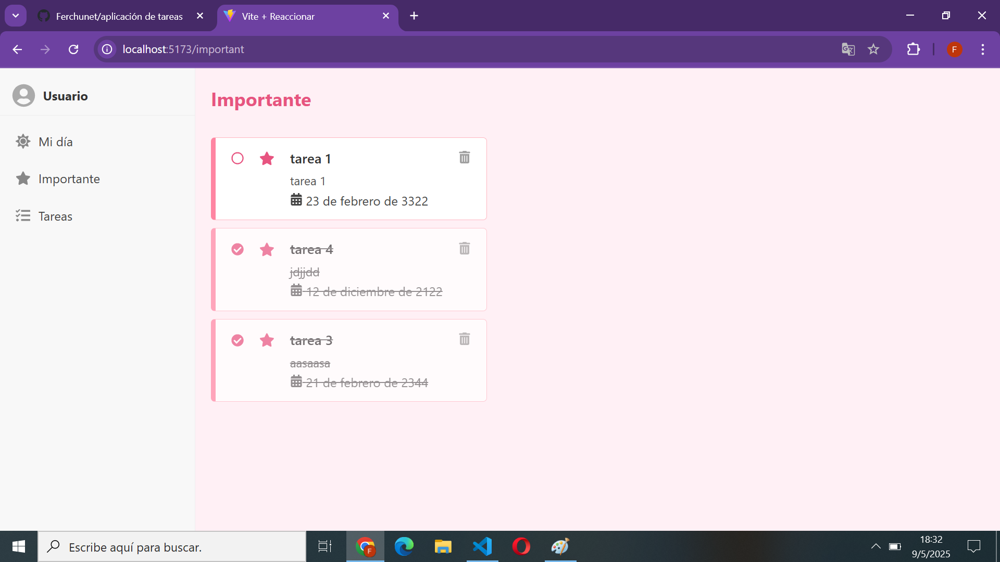
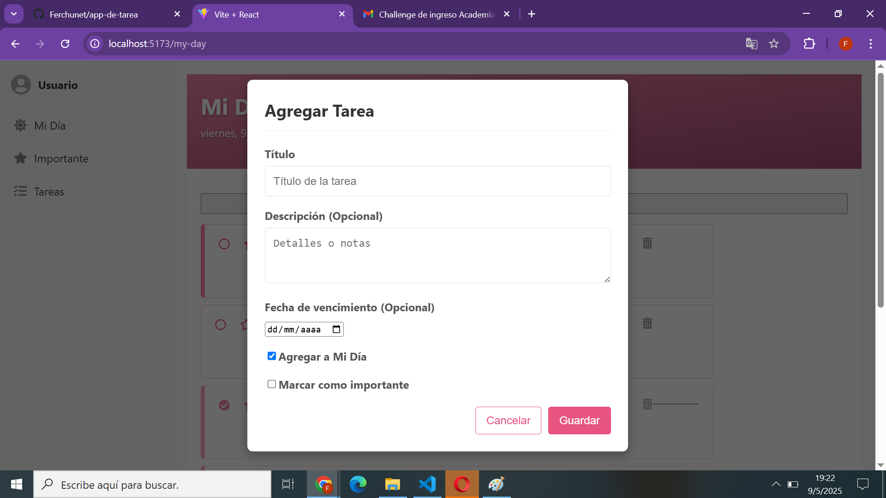

# Aplicación de Gestión de Tareas (To-Do App)

Este proyecto es una aplicación web simple para gestionar tareas personales, permitiendo organizarlas por "Mi Día", marcarlas como importantes y ver una lista completa con opciones de filtro y búsqueda.

## Características Implementadas

* **Gestión Completa de Tareas:** Crear, ver (todas), editar y eliminar tareas.
* **Marcado de Estado:** Marcar tareas como completadas/incompletas y como importantes/no importantes.
* **Vistas Organizadas:**
    * **Mi Día:** Muestra las tareas marcadas específicamente para el día actual.
    * **Importante:** Muestra todas las tareas marcadas como importantes.
    * **Tareas:** Muestra una lista completa de todas las tareas.
* **Filtrado en "Tareas":** Filtra la lista de tareas por estado (Todas, Completadas, Incompletas).
* **Búsqueda en "Tareas":** Busca tareas por título y descripción (filtrado en frontend sobre los resultados actuales).
* **Fecha de Vencimiento:** Permite asignar una fecha de vencimiento a las tareas y mostrarla en la lista.
* **Persistencia de Datos:** Las tareas se almacenan en una base de datos SQLite en el backend.
* **Interfaz de Usuario:** Diseño básico con una barra lateral de navegación y área de contenido principal.
* **Diseño Responsivo (Parcial):** Orientado principalmente a una vista amplia (PC).

## Tecnologías Utilizadas

* **Frontend:**
    * React (con Hooks)
    * Vite (para el entorno de desarrollo y build)
    * JavaScript (ES6+)
    * HTML5
    * CSS3
    * React Router DOM (para navegación)
    * React Icons (para iconos)
* **Backend:**
    * Node.js
    * Express (para la API REST)
    * SQLite (como base de datos)
    * `sqlite3` (driver para SQLite en Node.js)
    * `cors` (para permitir comunicación entre frontend y backend)
    * `uuid` (para generar IDs únicos para las tareas)
    * Nodemon (para reiniciar el servidor backend automáticamente durante el desarrollo)
* **Herramientas:**
    * npm / Yarn (gestores de paquetes)
    * Git (control de versiones)

## Prerrequisitos

Asegúrate de tener instalado lo siguiente:

* [Node.js](https://nodejs.org/) (incluye npm)
* Opcionalmente, [Yarn](https://yarnpkg.com/)
* [Git](https://git-scm.com/)

## Instalación y Ejecución Local

Sigue estos pasos para poner en marcha la aplicación en tu máquina local:

1.  **Clona el repositorio Git:**
    ```bash
    git clone <URL_DE_TU_REPOSITORIO>
    cd <nombre_de_la_carpeta_del_proyecto>
    ```
    *(Reemplaza `<URL_DE_TU_REPOSITORIO>` con la URL real de tu repositorio Git y `<nombre_de_la_carpeta_del_proyecto>` con el nombre de la carpeta que se cree)*

2.  **Instala las dependencias del Backend:**
    ```bash
    cd backend
    npm install
    # o si usas Yarn:
    # yarn install
    ```

3.  **Instala las dependencias del Frontend:**
    ```bash
    cd ../frontend # Vuelve a la carpeta raíz del proyecto y luego entra a frontend
    npm install
    # o si usas Yarn:
    # yarn install
    ```

4.  **Inicia el servidor Backend:**
    Abre una nueva terminal, navega a la carpeta `backend` y ejecuta:
    ```bash
    cd backend
    npm run dev
    # o si usas Yarn:
    # yarn dev
    ```
    Verás un mensaje indicando que el servidor backend está corriendo en `http://localhost:3001` y se conecta a la base de datos `tasks.db`. **Asegúrate de que no aparezcan errores al iniciar el backend, especialmente errores relacionados con SQLite.** Si es necesario, elimina el archivo `tasks.db` y reinicia el backend para regenerar la base de datos con la estructura correcta.

5.  **Inicia el servidor Frontend:**
    Abre otra nueva terminal, navega a la carpeta `frontend` y ejecuta:
    ```bash
    cd frontend
    npm run dev
    # o si usas Yarn:
    # yarn dev
    ```
    Verás un mensaje indicando que el servidor de desarrollo frontend está corriendo, probablemente en `http://localhost:5173`.

6.  **Abre la aplicación en tu navegador:**
    Visita `http://localhost:5173` (o el puerto que indique tu terminal de frontend) en tu navegador web.

## Estructura del Proyecto

La estructura principal del proyecto es la siguiente:


## Capturas de Pantalla


---







---
